# RushDay user manual

This manual is for the people who use RushDay: students, lecturers and administrators, and the university staff
deciding whether it suits them. It explains what every screen does and how to get things done, step by step. It
avoids technical terms; where one is unavoidable it is explained, and there is a [glossary](#9-glossary) at the end.

**Contents**

1. [What RushDay is, and trying the demo](#1-what-rushday-is-and-trying-the-demo)
2. [Getting started (everyone)](#2-getting-started-everyone)
3. [For students](#3-for-students)
4. [For lecturers](#4-for-lecturers)
5. [For administrators](#5-for-administrators)
6. [The public story page](#6-the-public-story-page)
7. [Privacy and security in plain words](#7-privacy-and-security-in-plain-words)
8. [Troubleshooting and FAQ](#8-troubleshooting-and-faq)
9. [Glossary](#9-glossary)

---

## 1. What RushDay is, and trying the demo

RushDay is a university web portal with three kinds of user. **Students** see their results, choose and enrol on
modules, and read their timetable and announcements. **Lecturers** see who is on their modules, enter marks and
submit them. **Administrators** run the academic calendar: they open enrolment, publish results on results day,
correct mistakes, look after accounts, and can see exactly who changed what. It is built to stay responsive when
thousands of people arrive at the same moment, such as the minute results are released. The [story page](#6-the-public-story-page)
shows the evidence.

### Trying the demo

A public demo is live at **https://rushday-api.onrender.com**. It belongs to a made-up institution, "RushDay Demo
University", with 20,000 invented students and 40 invented lecturers. No real people are in it. The sign-in page
lists three demo accounts, each with a **Use** button that fills in the username and password for you:

| Role | Username | Password | What it is set up to show |
|---|---|---|---|
| Student | `S000001` | `Student-Demo-2026!` | Completed Autumn 2025/26 with marks published; enrolled on CS3001 for Autumn 2026/27; can enrol on CS3099 |
| Lecturer | `L00001` | `Lecturer-Demo-2026!` | Leads CS3001 (100 students, marks in draft) and CS3099 (30 places); enters and submits marks |
| Administrator | `admin` | `Admin-Demo-2026!` | Enrolment windows, results publication and corrections, accounts, audit log, operations |

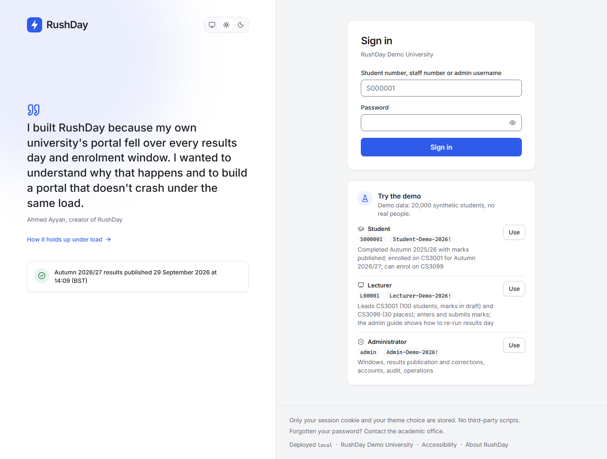

Things to know about the demo:

- **Anyone can use it at the same time**, so what you see may reflect what earlier visitors did. For example,
  another visitor may have filled the module CS3099 (only 30 places) or published the Autumn 2026/27 results. The
  demo tidies itself up (see "Demo reset" below).
- **The first page can take up to a minute to load** if nobody has used the demo for a while, because the free hosting
  puts it to sleep. RushDay shows "Waking the server. On the free tier this can take up to a minute." Wait; it
  does not need a refresh.
- **Demo accounts are read-only in a few places.** You cannot change their password, set up two-step verification for
  them, or lock or disable them. This keeps the demo usable for the next visitor.
- **Re-running results day.** To see the countdown and the moment results appear, sign in as the lecturer, enter and
  submit marks for CS3001, then as the administrator publish Autumn 2026/27 a few minutes ahead. The
  step-by-step recipe is in the [administrator guide](admin-guide.md#re-run-results-day-on-the-demo).
- **Demo reset.** The module CS3099 has its places freed automatically each time the demo restarts, and an
  administrator can do it on demand from the Operations page ([section 5.12](#512-operations-page-and-demo-reset)).

**A real deployment has no demo accounts.** When a university runs RushDay for real, the demo switch is off: the
three demo logins do not exist (any that were ever created are switched off), the sign-in page shows no credentials,
and administrators must use two-step verification. Everything else in this manual applies unchanged.

---

## 2. Getting started (everyone)

### 2.1 Signing in

1. Go to the RushDay address your university gave you.
2. Type your **student number** (for example `S000001`), **staff number** (for example `L00001`) or **admin username**.
3. Type your password. The eye icon on the right of the box shows or hides what you typed.
4. Select **Sign in**.

You land on your own home page: a student sees the dashboard, a lecturer sees "Home" with their modules, and an
administrator sees the overview.

The sign-in page also tells you when results are due ("Autumn 2026/27 results publish 29 September 2026 at 14:09
(BST)", with a live countdown) or when the latest results were published.

If your password is wrong you see **"Incorrect username or password."** After three wrong tries in a row the page
adds that repeated failures can pause sign-in for up to 15 minutes. See [Troubleshooting](#8-troubleshooting-and-faq).

### 2.2 Your first sign-in: choosing a new password

If an administrator created your account, they gave you a **temporary password**. When you first sign in you are
taken straight to a "Change password" page that says *"Your administrator set a temporary password. Choose a new one
to continue."* You cannot use any other page until you do.

1. Type the temporary password into **Current password**.
2. Type a new one into **New password** and again into **Confirm new password**.
3. A checklist beneath the box ticks off as you meet each rule: at least **12 characters**, at least **4 different
   characters**, it does not contain your username, and it does not contain the word "rushday". Very common
   passwords that have appeared in public data breaches are also refused. A long phrase of several unrelated words
   is an easy way to meet all of these.
4. Select the button to save. Changing your password signs you out on your other devices.

You can change your password again at any time from **Account → Change password**.

### 2.3 Two-step verification (administrators, and optional for lecturers)

Two-step verification means that, after your password, you also type a six-digit code from an app on your phone. Even
if someone learns your password, they cannot sign in without your phone.

- **Administrators must use it.** (The public demo's own `admin` account is the one exception, so visitors can look
  around without setting anything up.) Until an administrator has set it up, every page redirects to the setup page.
- **Lecturers may turn it on** from **Account → Two-step verification → Set up**. Students do not have this option.

**Setting it up:**

1. Install an authenticator app on your phone: Microsoft Authenticator, Google Authenticator or any app that supports
   "TOTP" (time-based codes).
2. Open the setup page (**Account → Set up**, or you are sent there automatically).
3. **Step 1:** scan the QR code with the app. If you cannot scan, type the key shown under the picture (there is a
   **Copy** button).
4. **Step 2:** type the 6-digit code the app now shows into **Verification code** and select **Turn on two-step
   verification**.

**Signing in afterwards:** enter your username and password as usual. A second step asks you to "Open your
authenticator app and type the 6-digit code for RushDay." If the code is rejected you see *"That code didn't work.
Check the time on your phone and try the newest code."* Codes change every 30 seconds and the clock on your phone
must be right (switch on automatic time). A code can be used only once, so wait for the next one if you have just
used it. **Start again** takes you back to the password step. You have five minutes to enter the code after
typing your password.

**Lost your phone?** Another administrator can reset your two-step verification (see
[Accounts](#56-accounts-and-two-step-verification)). The next time you sign in you are walked through setup again. There
are no printed recovery codes in this version.

### 2.4 Signing out, and how long you stay signed in

Open the menu with your name (top right) and choose **Sign out**. **Account → Sign out everywhere** ends your
sessions on every device at once, which is a good idea if you used a shared computer.

For your safety RushDay signs you out automatically:

| Who | After this long without activity | Or after this long in total |
|---|---|---|
| Students and lecturers | 8 hours | 12 hours |
| Administrators | 60 minutes | 8 hours |

If your session ends while you are typing something (for example, marks you have not saved), a small **Sign in
again** window appears on top of the page. Enter your password (and a code if you use two-step verification) and you
carry on with your work exactly where you were. If you decline, you are taken to the sign-in page. The marks
grid also keeps your unsaved marks safely in the browser and offers them back after you sign in
("Restored 3 unsaved marks from before you were signed out").

Your session also ends immediately everywhere if your password is changed or reset, or your account is locked or
disabled.

### 2.5 Forgotten passwords

There is **no "forgot password" email link**. RushDay does not send email. If you forget your password, **contact the
academic office** (the sign-in page says so at the bottom, and shows the office's email address or help link when your
university has set one). An administrator resets your password, giving you a new temporary password; you then
choose your own when you next sign in ([section 2.2](#22-your-first-sign-in-choosing-a-new-password)).
Administrators who forget their password ask another administrator.

### 2.6 Your account page

**Account** (from the menu with your name) shows your name, username, role, and for students the programme and year
of study. From here you can change your password, set up two-step verification (staff), sign out everywhere, choose
the appearance and, if you are a student, download your data ([section 3.9](#39-downloading-your-own-data)).

### 2.7 Light and dark appearance

RushDay has a **System / Light / Dark** switch (three small icons at the top of every page, also on the Account page).
"System" follows your device's setting. Your choice is remembered in your browser only.

### 2.8 Phones, accessibility and printing

- RushDay works on phones as narrow as 360 pixels. On a phone, students get a bar of four shortcuts at the bottom of
  the screen (Home, Results, Timetable, Modules) and the full menu behind the menu button at the top left.
- The aim is to meet the international accessibility standard WCAG 2.2 level AA. Everything can be done with the
  keyboard, there are visible focus outlines, colour is never the only way a status is shown, text contrast is checked
  in both themes, and animation stops if your device asks for reduced motion. Charts also have a table view with the
  same figures.
- The full **Accessibility statement** (link at the bottom of every page) says how it is tested, lists known limits
  and tells you how to report a problem.
- **Times** are shown in your institution's time zone (for the demo, UK time, written as BST or GMT) and the zone is
  named next to important times such as results day.

---

## 3. For students

The menu has five places: **Home, Results, Timetable, Modules, Announcements**.

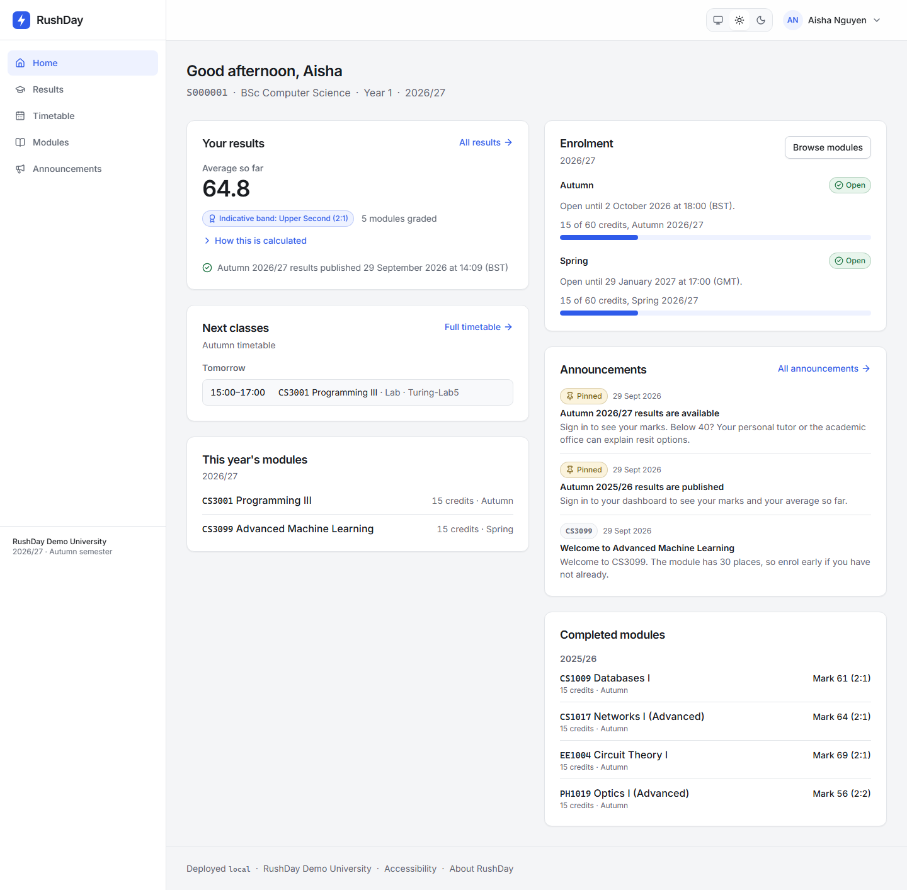

### 3.1 Your dashboard (Home)

The page greets you by name and shows your student number, programme, year of study and the academic year. It then
shows these cards:

- **Your results.** Your **average so far** and an **indicative band** (see [3.3](#33-results-in-detail)), and how many
  modules are graded. If results are due, it shows the date and a **countdown**.
- **Next classes.** Your next sessions this semester, with today first: time, module, whether it is a lecture or a
  lab, and the room.
- **This year's modules.** The modules you are enrolled on now, with credits and semester.
- **Enrolment.** For autumn and spring: whether the enrolment window is Open, Not open yet or Closed, when it closes,
  and a bar showing how many of your **60 credits** you have used ("15 of 60 credits, Autumn 2026/27"). **Browse
  modules** takes you to the catalogue.
- **Announcements.** The latest notices (pinned ones first).
- **Completed modules.** Modules from earlier years with your published mark.

### 3.2 Results day

When an administrator schedules the release of a semester's results, a **countdown** appears on the sign-in page,
your dashboard and your Results page: "Autumn 2026/27 results publish 29 September 2026 at 10:00 (BST)", counting down
in days, hours, minutes and seconds.

1. Keep the page open, or come back at the time. You do not need to refresh.
2. At the exact moment, the page says "Results are being released…", then **"Your results are in"** with a short
   notification, and your marks appear.
3. If the portal is very busy at that moment you may see *"Your results have been published, but the portal is very
   busy right now."* Select **Show my results**; this simply asks again.

Before the release time, nobody, including your lecturers, can show you a mark early. Until then the Results page
says the results are not yet published.

### 3.3 Results in detail

**Results** lists your marks grouped by academic year and semester, newest first. Each table has the module code and
title, credits, your **mark**, the **band** and the date it was published.

- **Absent** and **Deferred** are shown in words instead of a number. They do not count towards your average.
- **Amended** marks. If a mark was corrected after publication, the date appears with an **"Amended 29 Sept 2026"**
  label, so you can see it changed rather than it changing silently.
- A semester not yet released shows when it will be, or "Results not yet published".
- **Average so far** is weighted by credits: a 30-credit module counts twice as much as a 15-credit one. The bands are
  70 and above **First**, 60 to 69 **Upper Second (2:1)**, 50 to 59 **Lower Second (2:2)**, 40 to 49 **Third**, below 40
  **Fail**. The "indicative band" is only a guide: **your degree classification is decided by the exam board** on
  your whole programme. Select **How this is calculated** to read this on screen.
- **Footnote.** Under the tables your university may show a note. On the demo it reads: *"Below 40? Your personal
  tutor or the academic office can explain resit options."*
- **Print results summary** prints a clean page headed **"Unofficial results summary, not a transcript"**. Choose
  "Save as PDF" in your browser's print window to keep a copy.

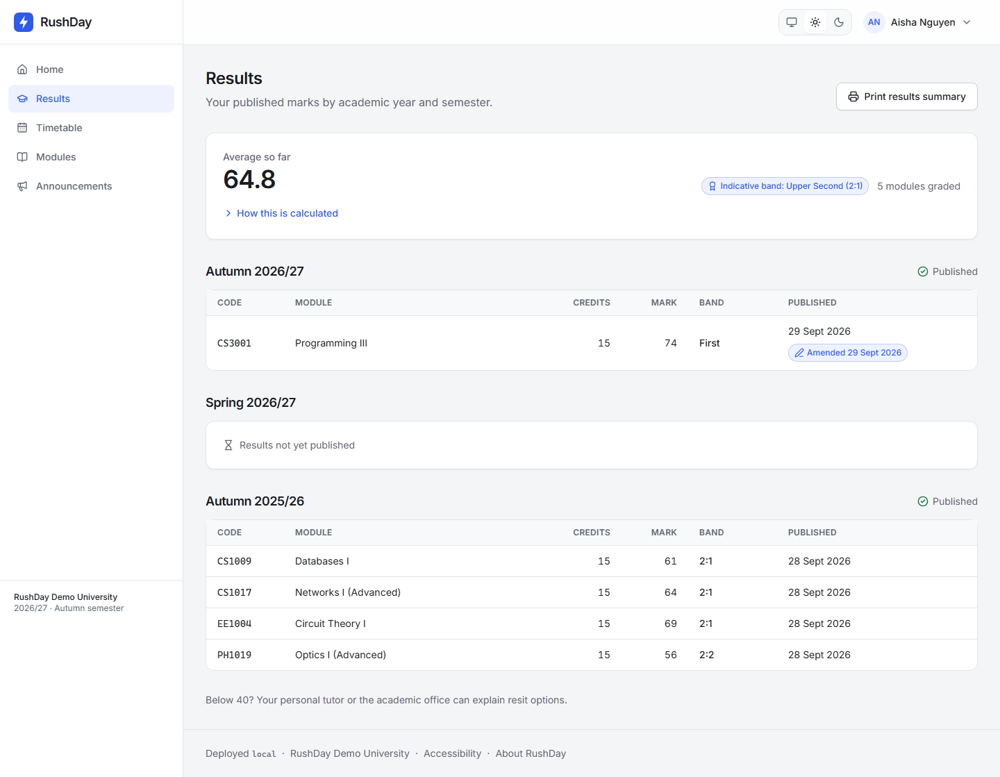

### 3.4 Timetable

**Timetable** shows the weekly classes of the modules you are enrolled on for the semester currently being taught.
On a wide screen it is a week grid; on a phone it is a list with a tab for each day. Each block names the module,
the room and whether it is a lecture or a lab. **Add to calendar (.ics)** downloads a file that you can open in
Outlook, Google Calendar or Apple Calendar; it adds each class as a weekly event for 12 weeks. If you are not enrolled
on anything this semester the page says "No classes this semester. Enrol on modules to build your timetable."

### 3.5 The module catalogue

**Modules** lists every running module for the year, 121 on the demo. A bar at the top shows your credit use for each
semester.

- **Search** by code or title (for example `CS3099` or `Databases`).
- **Filters:** Semester, Level, Department, Availability ("Places available") and **Enrolled only**. **Clear filters**
  resets them.
- Each card shows code, title, credits, semester, level, who leads it, and **how many places are left** with a bar.
  Places refresh every 30 seconds; open a module for live numbers.
- Select a module to see its description, lecturers, timetable, places and **Your status** on one page.

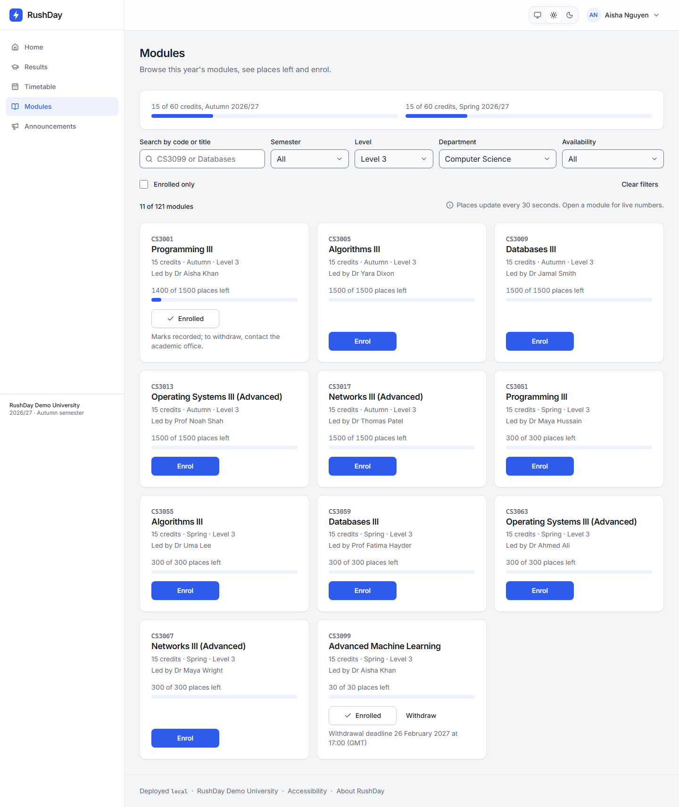

### 3.6 Enrolling on a module

1. Open **Modules** and find the module.
2. Select **Enrol**. The button changes to "Enrolling…" while RushDay confirms your place with the server. It is not
   guessed in advance, so you are told the truth.
3. A message confirms: **"You're in: CS3099. 29 places left."** The card now shows **Enrolled** and a **Withdraw**
   button.

The rules RushDay applies:

- **The window must be open.** You can enrol yourself only between the opening and closing times for that module's
  semester. Outside it, the module still shows, with the reason: "Enrolment for Autumn opens …" or "Enrolment for
  Autumn closed on …". Dates not yet announced show "Enrolment dates for … have not been announced yet."
- **Credit limit.** At most **60 credits per semester**. A module that would take you over shows "Over credit
  limit" and "That would take you over 60 credits for Autumn."
- **Places are limited and first come, first served.** A full module shows **Full**, "Places free up when students
  withdraw; there is no waiting list yet." If it fills while you click, you see "Filled while you were enrolling".
- **Locked modules.** Once the lecturers have submitted a module's marks for the year, nobody can join it. You see
  *"Marks for CS3001 have already been submitted this year, so you can't join it now. Contact the academic office."*
- **Already completed.** A module you finished in an earlier year shows **Completed 2025/26** with your result; it
  cannot be taken again in this version.
- **No longer running** modules show "Not running".
- If you withdrew earlier and places remain, the button reads **Enrol again**.

### 3.7 Withdrawing from a module

1. On the module card or page, select **Withdraw**.
2. A confirmation asks: "Withdraw from CS3099? Your place is released immediately." It also shows the withdrawal
   deadline and whether you could enrol again (it tells you if the enrolment window has closed and you would not be
   able to).
3. Confirm. You see "You've withdrawn from CS3099. Your place has been released."

You can withdraw only **before the withdrawal deadline** and only while **no marks have been submitted or
published** for that module. The page explains why beforehand: "Withdrawal deadline passed …" or "Marks recorded; to
withdraw, contact the academic office." In those cases the academic office can still help.

### 3.8 Announcements

**Announcements** lists notices from the university and from the modules you are currently enrolled on, with pinned
ones first. Announcements about results being available appear when results are published and are removed if results
are cancelled or unpublished.

### 3.9 Downloading your own data

**Account → Your data → Download my data (JSON)** saves a file with your student record, enrolments and published
marks, as RushDay holds them. This is also recorded in the audit log. A JSON file is plain text structured for
computers; you can open it in any text editor.

### 3.10 Messages a student might see

| Message | What it means and what to do |
|---|---|
| Incorrect username or password. | Check your student number (starts with S) and password. After repeated failures sign-in pauses; see section 8. |
| Too many attempts. Try again in 60s. | You or someone on your network tried too often. Wait for the countdown and try once more. |
| Your session has ended. Sign in again. | You were idle too long, or you signed out elsewhere. Sign in again. |
| Your page is out of date. Reload and try again. | Reload the page (press F5) and repeat the action. |
| You're already enrolled on CS3099. | Nothing to do; you already have the place. |
| CS3099 is full. | No places left. Check back; places free up when others withdraw. |
| CS3099 is no longer running. | The module has been closed. Ask the academic office. |
| Enrolment for Autumn closed on … / opens … | The window is not open. The date shows when. |
| That would take you over 60 credits for Autumn. | Withdraw from another autumn module first, or contact the academic office. |
| Marks for CS3001 have already been submitted this year, so you can't join it now. | The module's marks are locked. Contact the academic office. |
| CS3001 already has a submitted or published mark, so it can't be changed here. | You cannot enrol or withdraw on a module with a recorded mark. Contact the academic office. |
| The withdrawal deadline for CS3099 was … | Too late to withdraw yourself. Contact the academic office. |
| You're not enrolled on CS3099. | You tried to withdraw from a module you are not on. |
| Your record is marked as left. | The university has recorded that you have left. Contact the academic office. |
| The portal is very busy right now. Try again in a moment. | RushDay is protecting itself under heavy load. The button waits a few seconds and you try again. Nothing was lost. |
| The server could not be reached. Check your connection and try again. | Your internet connection, or the demo is waking up. Retry. |
| Something went wrong on our side. Reference …. | An unexpected problem. Try again; if it persists tell the academic office the reference code. |
| Your current password is incorrect. / Use at least 12 characters. | Shown on the Change password page; follow the checklist. |

---

## 4. For lecturers

The menu has **Home, My modules, Announcements**.

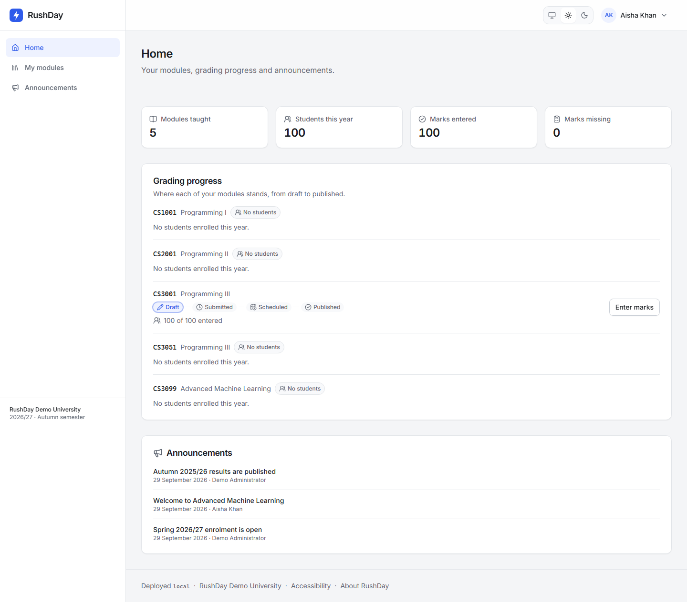

### 4.1 Home and My modules

**Home** shows tiles for modules taught, students this year, marks entered and marks missing, then **Grading progress**
for each of your modules: a path from **Draft → Submitted → Scheduled → Published** with the current step
highlighted, how many marks are entered, and an **Enter marks** (or **View marks**) button. University announcements
appear underneath.

**My modules** is a table of every module you teach this year: code, title, semester, number enrolled, marks status,
entered/missing counts, **your role** and shortcuts to the module's tabs. If nothing is listed, "No modules are
assigned to you. Ask an administrator."

### 4.2 Leader and teacher roles

Every module has exactly **one leader** and may have other **teachers**. Both can see the roster, enter and save
marks and post announcements. **Only the leader can submit the module.** A teacher sees "Ask {leader's name} to
submit." and the module page shows your role as a badge. An administrator assigns these roles.

### 4.3 The roster

Open a module (**My modules**, then the module code). The **Roster** tab lists each enrolled student: number, name,
programme, year, date enrolled and status. Search by the start of a student number or any part of a name. The
roster is for the current academic year.

A roster in spreadsheet (CSV) form exists in the RushDay server, but this version of the web app has no button for
it; ask your administrator if you need one. Exporting a roster is recorded in the audit log.

### 4.4 Entering marks

Open the **Marks** tab. Every student on the module is a row, in student-number order with active students first.

1. For each student choose an **Outcome**:
   - **Mark**: type a whole number from **0 to 100** in the Mark box. Anything else shows "Enter a whole number
     from 0 to 100."
   - **Absent**: the student did not sit it. No number.
   - **Deferred**: the student's assessment is postponed. No number.
2. You can move down the column with Enter or the arrow keys, and **paste** a column of numbers copied from a
   spreadsheet starting at the box you have selected.
3. The counter beside the buttons shows "3 unsaved". Select **Save marks**; you see "Saved 3 changes." Nothing is
   stored until you save. The page warns you if you try to leave with unsaved changes.
4. Use the search box and page controls to move through large modules (100 rows per page). Unsaved edits are kept
   while you change pages.
5. The "Updated" column shows when each mark last changed and by whom. Students who have withdrawn show
   "Withdrawn: not submitted" and cannot be given a mark.

Marks are drafts. **No student can see them** until they are submitted, then published by an administrator.

### 4.5 When two people edit the same mark (conflicts)

If a colleague saves a different value for a student while you are editing, RushDay never silently overwrites theirs.
When you save, the row is highlighted and says "Changed to 71 by Maya Hussain while you were editing. Save again to
keep yours.", with a message "Someone else changed 1 mark. Review the highlighted row and save again." Look at the
stored value, decide which is right, and press **Save marks** again to keep yours (or change the box to theirs).
Everything else you edited is saved normally.

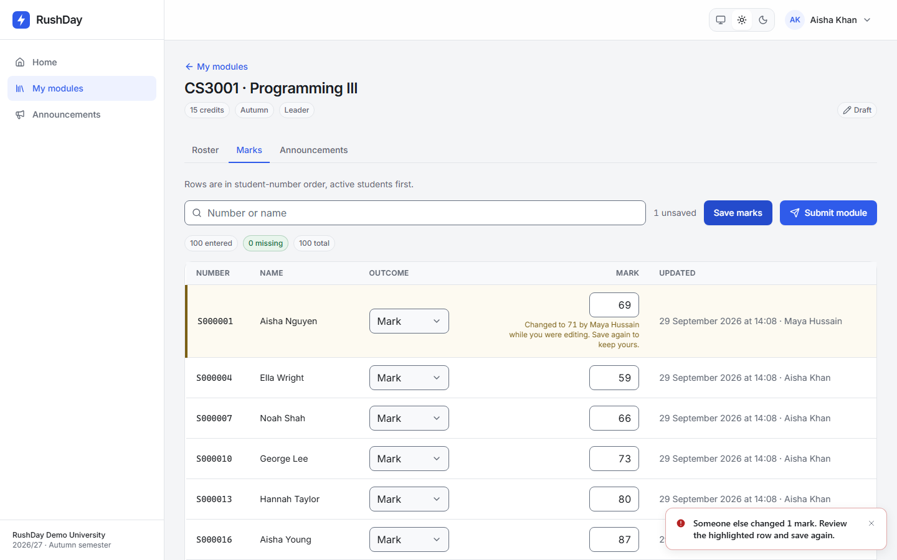

If saving fails for some rows you see "Saved 8 of 10 changes; 2 need attention." with the reason on each row.

### 4.6 Submitting a module

Only the **leader** sees the **Submit module** button.

1. Make sure every active student has a mark, **Absent** or **Deferred** and that nothing is unsaved. The pills above the table show "100 entered, 0
   missing, 100 total".
2. Select **Submit module**. A window asks "Submit 100 marks for CS3001?" and explains that marks are locked and go to
   the academic office. If anyone is still missing it lists them by number and name; you cannot submit until they
   have an outcome. If you have unsaved changes it tells you to save first.
3. Confirm. You see "Submitted 100 marks for CS3001."

### 4.7 After submission

- The marks are **locked** for you and your colleagues. The Marks tab shows a banner: "Submitted on … Marks are locked.
  Spotted an error? Ask the academic office to return this module to draft."
- An administrator **publishes** results for the whole semester at a chosen time. Until then students see nothing. Once
  scheduled, the banner says "Scheduled for publication on … Students can't see these marks yet." After publication it
  says "Published on … Students can see these marks; the academic office corrects a single mark if one is wrong."
- To change anything, ask the academic office. They can **return the module to draft** (if not yet live) so you
  can edit and resubmit, or correct a single mark with a written reason, which the student sees labelled "Amended".
- If someone joins a module after it has been submitted, nobody can; the registry has to return it to draft first.

### 4.8 Module announcements

The **Announcements** tab on a module lets you post notices to the students enrolled on **that module** (only your
own modules). Select **New announcement**, give it a **Title** and **Message** (plain text with line breaks),
choose whether to **Pin to the top**, and optionally set **Publish at** (empty means now) and **Expires at**. You can
edit or delete your announcements from the same list.

---

## 5. For administrators

Administrators have the widest menu: **Overview, Students, Modules, Lecturers, Accounts, Enrolment windows, Results,
Announcements, Audit log, Operations, Settings**. This section tells you what each does. The finer detail (what the
rules are and why) is in the **[administrator guide](admin-guide.md)**. Every action that changes something asks
for a **reason** where it matters (10 to 400 characters), and is recorded in the audit log.

### 5.1 Overview

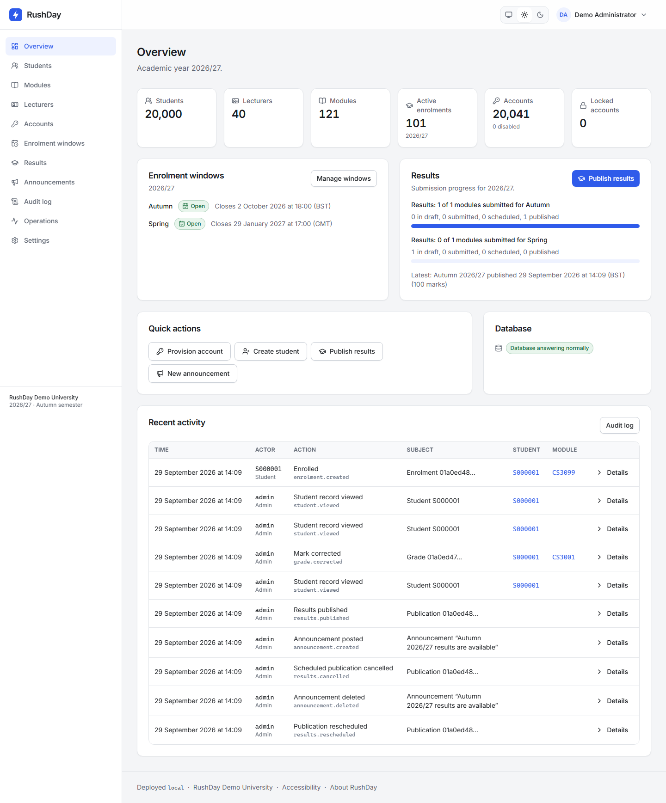

Counts of students, lecturers, modules, active enrolments, accounts and locked accounts; the current enrolment windows;
submission progress per semester; quick actions; a database health badge; and **Recent activity** from the audit
log.

### 5.2 Enrolment windows

**Enrolment windows** has one row per academic year and semester with three instants: when self-enrolment **opens**,
when it **closes**, and the **withdrawal deadline** (not before the close). Select **Add window**, or edit or delete
an existing one. Times are in the institution's time zone. Only one window may exist for each year and semester ("A
window for … already exists. Edit it instead."). Opens must be before closes.

### 5.3 Results: publish, schedule and correct

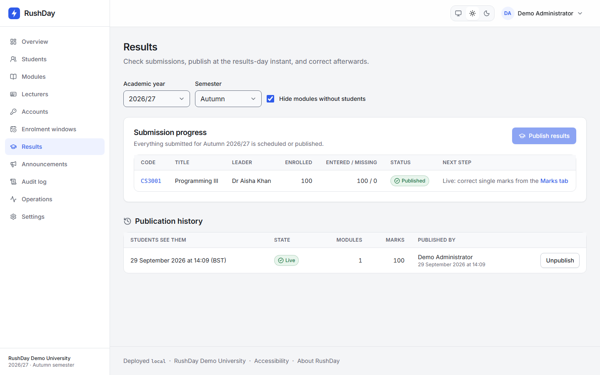

**Results** shows, for the year and semester you pick, each module's leader, how many marks are entered or missing,
its **status** (Draft, Submitted, Scheduled, Published) and the next step. "Hide modules without students" is on by
default.

**Publish.** Select **Publish results**.

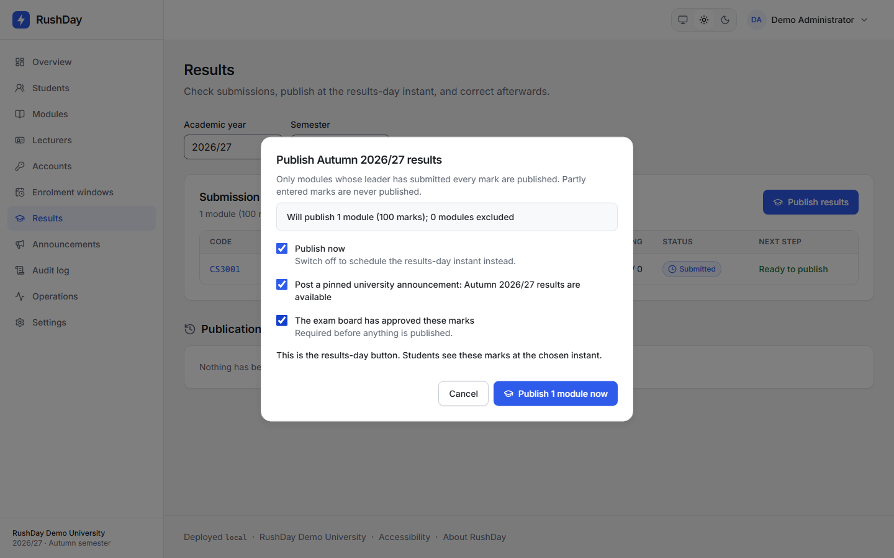

1. The window shows how many modules will be published and how many excluded. Only modules whose leader submitted
   every mark are published; partly entered marks never are.
2. Leave **Publish now** on to release immediately, or switch it off and pick **Students see the marks at** (a
   date and time within the next 90 days) to schedule the results-day moment.
3. Optionally tick **Post a pinned university announcement** ("results are available").
4. Tick **The exam board has approved these marks**. This is required.
5. Confirm. You will see "Publish 1 module now" or "Schedule 1 module for …".

**After scheduling, before the time arrives:** you can **Reschedule** (a new time; students see nothing until
then), **Cancel** the publication (marks go back to Submitted; students never saw anything) or **Return a module to
draft** with a reason (it is removed from the publication).

**Once live:** **Unpublish** with a reason (marks go back to Submitted and students stop seeing them at once), or
**correct a single mark**. From the **Marks** tab of a module, or a student's record, use **Correct** to choose the
outcome and number and give a reason. The student sees the corrected mark immediately, labelled **Amended**. Corrections
are possible any time after submission, not while a module is still in draft.

Every one of these actions is recorded with before and after values and the reason. There is deliberately no way to
change a mark that is not recorded.

### 5.4 Students

**Students** searches by the start of a student number or part of a name. **Create student** adds a record (number,
name, programme, year, optional email). Opening a student shows their record **as the student sees it**, plus extra
detail: status, account, every enrolment (all years, with source and dates), every mark with whether the student can
see it yet, and recent audit activity. Opening a record is itself logged.

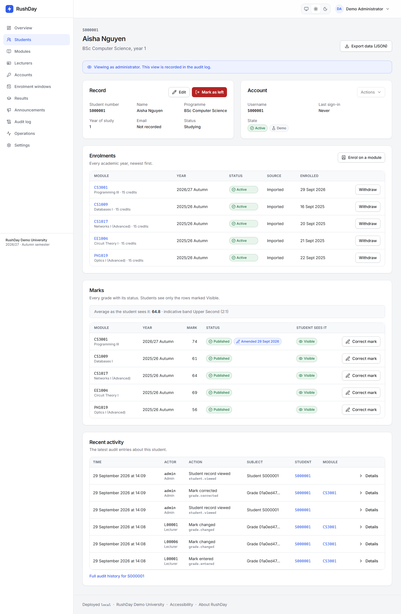

From a record you can:

- **Edit** the name, programme, year or email.
- **Provision account** if the student has none.
- **Override-enrol** or **override-withdraw** (see [5.7](#57-overrides-and-trim-to-capacity)).
- **Export data (JSON)** for a subject-access request; this is audited.
- **Mark as left**, which withdraws this year's enrolments that hold no submitted or published mark and disables the
  account.

### 5.5 Modules and lecturers

**Modules** lists modules with capacity, enrolled this year, leader and marks status; filter by semester, search, and
optionally show inactive ones. **New module** or **Edit** sets code (two letters, four digits; the first digit is the level), title,
description, credits, capacity, semester and whether it is running. Rules: capacity can never go below the number
already enrolled; the semester can be changed only while the module has never had any enrolment or mark; an inactive
module leaves the catalogue but students keep their history. Opening a module has **Details, Roster and Marks**
tabs. The Details tab includes **Lecturers**: choose the lecturers and set **exactly one leader**; lecturers who have
left cannot be assigned. The Roster and Marks tabs are read-only views, and the Marks tab is where you correct marks.

**Lecturers** lists staff with department, modules and whether they have an account. **Create lecturer** and **Edit**
manage the record. **Mark as left** switches off the account; their module assignments stay on record, but without
authority.

### 5.6 Accounts and two-step verification

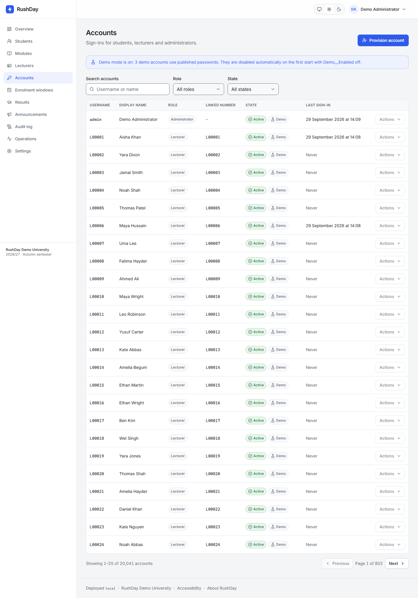

**Accounts** lists every sign-in, filterable by role and state. **Provision account** creates a sign-in for an existing
student or lecturer (only those without one are offered) or for a new administrator. You may type a temporary
password or leave it blank to generate a 16-character one. It is **shown once** in a window with a copy button; give
it to the person through a private channel. If lost, reset the password to make a new one. The person must change
it at first sign-in.

The **Actions** menu on each account offers:

- **Reset password**: the current password stops working, every session ends, and a new temporary password is shown.
- **Lock** (a temporary block, for example after suspicious activity) and **Unlock**.
- **Disable** and **Enable** (for accounts that should not sign in, such as people who have left).
- **Reset two-step verification**: clears the person's authenticator so they set it up again. An administrator in
  this state can use only the setup pages until they have done so.
- **View student** for student accounts.

You cannot lock or disable your own account, and **demo accounts** are read-only because the demo repairs them at every
restart.

### 5.7 Overrides and trim to capacity

On a student's record, an administrator can enrol or withdraw a student **outside the normal rules**, always with a
written reason:

- **Override-enrol** ignores the enrolment window and the credit limit. A full module stays full unless you tick
  **Raise capacity by one if full**, which adds exactly one place and only when the module really is full. Nobody can
  be enrolled, even by override, on a module whose marks have been submitted; return it to draft first.
- **Override-withdraw** withdraws from a module whatever the deadline.
- **Trim to capacity**, on a module that has more students than places, withdraws the most recent self-enrolments
  down to the capacity in one audited action.

### 5.8 Announcements

**Announcements** is where you write university-wide notices (reaching every student and lecturer) and see every
module's announcements, including scheduled and expired ones. You can set a pinned notice, a publish time and an
expiry. Edit or delete as needed; deletion is audited.

### 5.9 Audit log and exports

**Audit log** shows who changed what and when. Entries cannot be edited or deleted. Filter by **Actor**, **Action**, **Student
number**, **Module code** and **Date range**. **Export CSV (up to 50,000 rows)** downloads the filtered list as a
spreadsheet; if it hits the limit RushDay says so and suggests narrowing the date range to 31 days or less. The
export is itself recorded. Reading personal data in bulk (viewing a student, exporting data or a roster) is
also logged, so you can answer "who has looked at this student's data?"

### 5.10 Settings

**Settings** holds the **academic year**, the **current semester** (decides whose classes appear on timetables), the
institution name and short name, the **time zone** (for example `Europe/London`), and the **academic office email and
help URL** that appear wherever students are told to "contact the academic office". Changing the **academic year**
starts a new year for everyone: this year's windows no longer apply, credit budgets and module places start from
zero, and last year's modules become "completed". RushDay asks you to confirm and advises creating the new year's
windows first.

### 5.11 Single sign-on and retention

This version signs people in with RushDay's own accounts. Single sign-on (for example Microsoft Entra ID) is not built.
Audit entries are kept indefinitely. See [admin-guide.md](admin-guide.md#7-single-sign-on-extension-point-not-built).

### 5.12 Operations page and demo reset

**Operations** describes the system's live health in plain language and updates while you watch: "Running normally",
"Busy: some visitors are being asked to try again" or "Struggling". It shows visits per second, how long the slowest
requests take, errors, how many visitors were turned away to protect the system, database connections in use and
memory, charts for the last 60 minutes, and counters (for example enrolment accepted/full). **Data checks** warns when a
module has more students than places and offers **Re-count places** to correct the counts. Under "The load story" it
repeats the measured results from the story page. RushDay does not send alerts; look at this page after a change and
on results day.

On the public demo only, **Reset demo module** frees places on CS3099 by withdrawing demo visitors' self-service
enrolments that have no mark.

For full detail on each of these areas, including re-running results day on the demo, read the
**[administrator guide](admin-guide.md)**.

---

## 6. The public story page

**/story** (link "About RushDay" at the foot of every page) needs no sign-in, on any deployment. It tells why RushDay
was built and shows measured results: an early version handed out 154 places on a 30-place module, ran out of database
connections and slowed sharply under heavy load; each cause was fixed and the same tests rerun. Charts have table views, a
glossary explains terms such as "slowest 5%", and a link goes to the source code. It shows test results from the
project, never any university's real data.

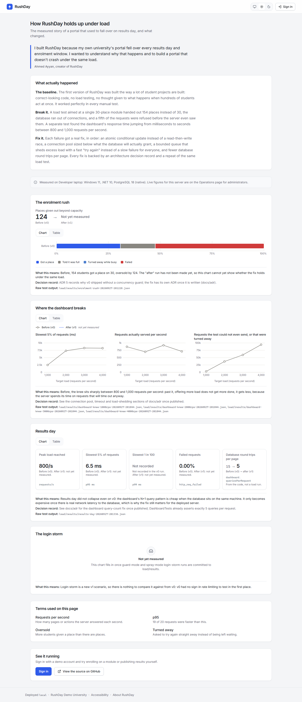

---

## 7. Privacy and security in plain words

- **What is stored about you:** your name, number, programme and year (students), enrolments, marks, when you last
  signed in, and whether your account is locked. Email is optional.
- **Cookies:** only a session cookie that keeps you signed in, and your light/dark choice. No tracking or third-party
  scripts.
- **Passwords** are stored scrambled so even administrators cannot read them. Very weak or breached passwords are
  refused. Repeated failed sign-ins are slowed down or paused.
- **Sessions** end after inactivity, on password change or reset, on lock or disable, and when you choose "Sign out
  everywhere".
- **Who sees marks:** students see a mark only after it is published at its release time, and only for modules they are
  actively enrolled on. Lecturers see only their own modules. A single check controls all student views.
- **The audit log** records every change to enrolments, marks, results releases, accounts, settings, windows and
  modules, with who, when and (where relevant) why. It cannot be edited or deleted. Viewing a student record and
  exporting data are recorded too. Failed sign-ins are counted rather than logged individually, and lockouts are logged.
- **IP addresses are never stored**; scrambled one-way versions that change daily are used so abuse can be spotted
  without identifying anyone. Logs never contain names, marks or passwords.
- **Your data:** students can download their own data any time. The academic office can export a student's data for a
  subject-access request. Where data lives and retention are in [docs/deployment.md](deployment.md).

---

## 8. Troubleshooting and FAQ

**"Too many attempts. Try again in 60s."** RushDay limits rapid sign-ins and requests to stop guessing. Wait the number of
seconds shown. Pause also applies per account: after repeated failures from several places an account can be paused
for up to 15 minutes. If it persists, contact the academic office.

**"The portal is very busy right now. Try again in a moment." / "Server busy".** During extreme load RushDay quickly asks
people to retry instead of making everyone wait. Wait a few seconds (the button counts down) and try again. Nothing you
did was lost.

**The first page is very slow.** The demo sleeps when idle and takes up to a minute to wake.

**"Enrolment for Autumn closed on …" / "outside the enrolment window".** Self-enrolment is only possible between the
window's opening and closing times. Contact the academic office, who can enrol you as an exception.

**"Marks for CS3001 have already been submitted this year, so you can't join it now." (module locked).** The module's marks
have left draft. Nobody can join until an administrator returns it to draft. Contact the academic office.

**I can't withdraw.** Either the deadline has passed or marks have been recorded for the module. The Withdraw button
is replaced with the reason; contact the academic office.

**The module is full and I want a place.** Places free up when others withdraw; check back. There is no waiting list.

**My results aren't showing.** They appear at the published time and never earlier. Check the countdown. If it has
passed, look at the Results page and select **Show my results** if offered. If your module is not in the list, it may
not have been submitted yet; ask your lecturer or the academic office.

**A mark says "Amended".** The mark was corrected after publication; the date shows when.

**"That code didn't work."** Check your phone's clock is set automatically, use the newest code, and don't reuse one.

**I lost my phone (administrator).** Ask another administrator to reset your two-step verification.

**I forgot my password.** Contact the academic office; there is no email reset.

**"Your page is out of date. Reload and try again."** Reload and repeat the action.

**"Demo accounts are read-only, so the demo stays usable for the next visitor."** You tried to change a demo account's
password, lock or two-step settings. That is blocked on purpose.

**"Someone else changed 1 mark." (lecturer).** See [4.5](#45-when-two-people-edit-the-same-mark-conflicts).

**"No submitted modules are ready to publish for Autumn 2026/27." (administrator).** Lecturers must submit modules from
their Marks pages first.

**"These results are already live. Unpublish them instead." / "These results are not live yet. Cancel the scheduled
publication instead."** Use the action that matches the state.

**"Choose a date within the next 90 days."** Results can be scheduled at most 90 days ahead.

**"Capacity can't go below the 30 students already enrolled."** Trim the module first or choose a higher capacity.

**"Something went wrong on our side. Reference …".** Try again. If it continues, give the reference code to the person
running RushDay so they can find the details.

---

## 9. Glossary

- **Academic year**: the university year, written like 2026/27.
- **Administrator**: staff with access to the administration pages.
- **Amended**: a published mark that was corrected afterwards, shown with the date.
- **Audit log**: the permanent, tamper-resistant record of who did what and when.
- **Authenticator app**: a phone app that shows a new six-digit code every 30 seconds.
- **Band / indicative band**: the range your average falls in (First, 2:1, 2:2, Third, Fail). A guide only.
- **Capacity**: the number of places on a module.
- **Credits**: a measure of a module's size; the limit is 60 per semester.
- **CSV**: a simple spreadsheet file.
- **Deferred**: assessment postponed to a later time; no mark yet.
- **Draft**: marks being entered; invisible to students.
- **Enrolment window**: the period when students can enrol themselves.
- **Exam board**: the group that approves marks and decides degree classifications.
- **JSON**: a plain-text data file format used for your personal data download.
- **Leader / teacher**: the lecturer who submits a module's marks / other lecturers on it.
- **Locked module**: a module whose marks have been submitted, so nobody can join it or edit marks.
- **Override**: an administrator action that bypasses a normal rule, with a recorded reason.
- **Pinned**: an announcement kept at the top.
- **Published / scheduled**: marks students can see / marks that will become visible at a set time.
- **Roster**: the list of students on a module.
- **Semester**: autumn or spring.
- **Session**: the period you stay signed in.
- **Submitted**: the leader has declared the marks complete; they are locked.
- **Trim to capacity**: withdrawing the newest enrolments from an overfull module.
- **Two-step verification (TOTP)**: a password plus a phone code at sign-in.
- **Unpublish**: take live results back to Submitted.
- **Withdrawal deadline**: the last moment a student can withdraw themselves.
